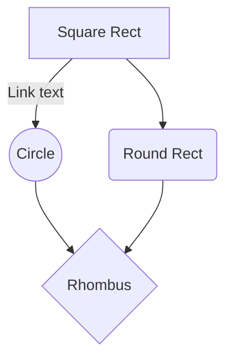

# Vladislav Mukhlisov


## About me
I am Unity developer

## My strengths
- Highly motivated to solve problems right now and not to postpone them

## Technical Skills
- C#
- Unity
- Architecture
- Design patterns
- Git
- Agile
- Team management
- Technical writing
- Technical mentoring
- Technical leadership
- SOLID
- OOP
- TDD
- RX (UniRx)
- Task (UniTask)
- MVC, MVVM, MVP, VIPER
- Native plugins integration (Android, iOS)

## Projects


## Test

```csharp
using System;

public class Program
{
    public static void Main()
    {
        Console.WriteLine("Hello World");
    }
}
```





```stl
solid cube_corner
  facet normal 0.0 -1.0 0.0
    outer loop
      vertex 0.0 0.0 0.0
      vertex 1.0 0.0 0.0
      vertex 0.0 0.0 1.0
    endloop
  endfacet
  facet normal 0.0 0.0 -1.0
    outer loop
      vertex 0.0 0.0 0.0
      vertex 0.0 1.0 0.0
      vertex 1.0 0.0 0.0
    endloop
  endfacet
  facet normal -1.0 0.0 0.0
    outer loop
      vertex 0.0 0.0 0.0
      vertex 0.0 0.0 1.0
      vertex 0.0 1.0 0.0
    endloop
  endfacet
  facet normal 0.577 0.577 0.577
    outer loop
      vertex 1.0 0.0 0.0
      vertex 0.0 1.0 0.0
      vertex 0.0 0.0 1.0
    endloop
  endfacet
endsolid
```