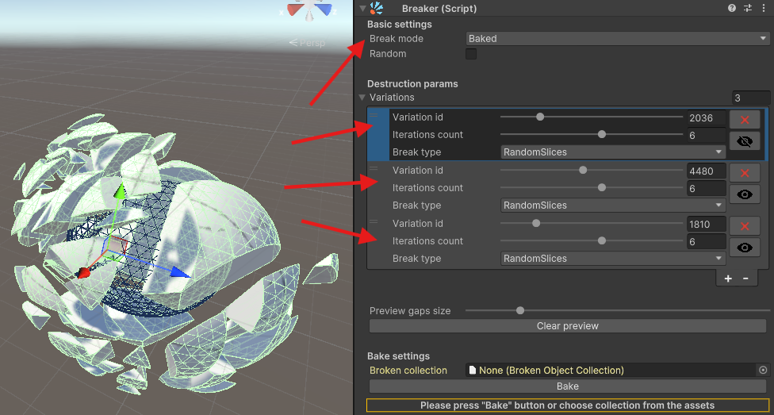

# How to Use Broken Collections

This guide will help you use the "Broken Collections" feature of the Breaker component for efficient object destruction
in Unity. With Broken Collections, you can pre-bake destruction variations to minimize computational load during runtime
and ensure consistent behavior across multiple instances of similar objects.

## Step-by-Step Guide

### 1. Setting Up the Breaker Component

Add the `Breaker` component to your GameObject.

- Navigate to the GameObject you want to destruct in Unity and add the `Breaker` script component.

### 2. Choose Break Mode

In the `Breaker` component settings, set `Break Mode` to **Baked**.

- `Break Mode` determines whether the object will be broken in `Runtime` or using precomputed (baked) fragments. By
  choosing **Baked**, you will use precomputed destruction to optimize performance.

### 3a. Configure Destruction Variations

In the `Destruction Params` section, configure the `Variations`.

- Use the **Plus (+)** button to add new variations.
- Set the `Variation ID`, `Iterations Count`, and `Break Type`. These parameters allow you to determine how the
  object will break.
- You can also use the **eye icon** to preview how each variation will look.

### 3b. (OR) Use Random Variations

### 4. Bake the Broken Collection

Scroll down to the `Bake Settings` section.

- Click the `Bake` button to precompute the destruction and create a `Broken Collection`.
- The `Broken Collection` asset will be saved, and you can reuse it for other GameObjects to maintain consistent
  destruction.
- Alternatively, you can select an existing `Broken Collection` asset by clicking the selection field.

Once you have the `Baked Collection` assigned, some settings will disappear in the `Breaker` component, as they are no
longer needed

### 5. Assign the Broken Collection to Other Objects (if needed)

Assign the `Broken Collection` to other objects with the `Breaker` component.

- If you have multiple GameObjects with the same shape that should use the same destruction settings, simply assign the
  created `Broken Collection` to their `Breaker` components. This ensures that all these objects will use the same
  fragmentation method when destroyed, allowing for efficient reuse of precomputed shards.

### 6. Viewing the Collection

To view the `Broken Collection`, you need to select an object that uses the collection (or attach the collection to an
object with the `Breaker` component) and use the Preview option.

(Insert screenshot showing the Preview option being used to view the Broken Collection)

### 7. Test the Destruction in Play Mode

Test the destruction using any convenient method.

- You should see the object being replaced with precomputed shards when destroyed. Since these shards are already baked,
  the destruction process will be more performant compared to runtime destruction.
- For more information on different ways to trigger destruction, please refer to
  the [destruction initiation guide](link_to_testing_guide).

### Benefits of Using Broken Collections

- **Optimized Runtime Performance**: Pre-baked destruction reduces the computational load during gameplay.
- **Pooling**: Each `Broken Collection` asset can be pooled at the start of the game or during instantiation, allowing
  for efficient reuse across multiple instances.

### Tips

- You can skip selecting specific variations if you use the `Random` parameter. In this case, you need to specify the
  `Variations count` and `Slice iteration count` (degree of fragmentation). The collection will then have random
  variations generated, which you can review later.
- Preview destruction in the Editor to ensure each variation looks the way you want.

(Insert an additional screenshot showing the final result of using Broken Collections on multiple objects in the scene)

## Advanced

### Collection and pool settings

Coming soon...

### Collection structure

Coming soon...

### Create collection using external tools

Coming soon...