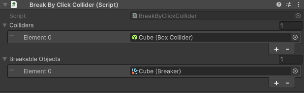

# How to trigger destruction

There are two main ways to trigger the destruction of an object with the Breaker component

## 1. Using components

### Use the `Break By Click Collider`



Your object will be destroyed when you click on it by mouse or tap on it by touch

### Use the `Break By Collision Collider`


Your object will be destroyed when it collides with another object. Please ensure that one of the objects has a
rigidbody attached

## 2. From code

Call the `Breaker.Break()` method to trigger the destruction from code. For example:

```csharp
public class Player : MonoBehaviour
{
    private void OnCollisionEnter(Collision other)
    {
        Breaker breaker = other.gameObject.GetComponent<Breaker>();
        if (breaker != null)
        {
            breaker.Break();
        }
    }
}
```